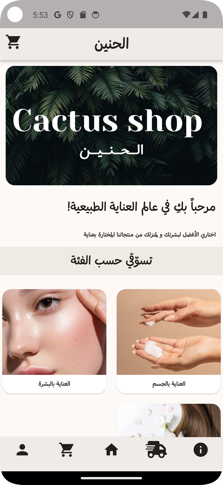
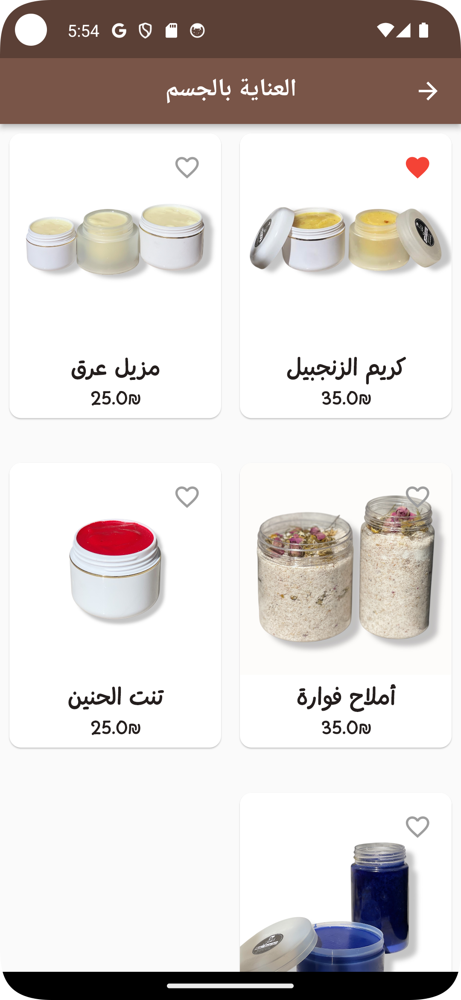
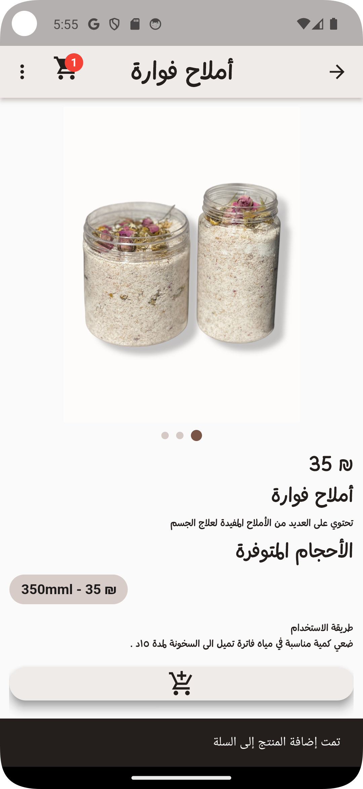

# 🌵 Cactus Shop

**Cactus Shop** is an e-commerce Flutter application that offers a collection of natural beauty products handmade by Palestinian artisans.

> 🗣️ **Note:** The app is fully designed and developed in **Arabic** to suit Arabic-speaking users.

## 🔗 Live Website
[https://cactus-shop-ps.netlify.app](https://cactus-shop-ps.netlify.app)

> 📱 For the web version, visit the main repository:   
> [Cactus Shop Flutter Project Web](https://github.com/MariaGhanem/Cactus_Shop-FlutterProject-web-)


## 📥 Android APK Download  
> 📱 If you'd like to install the app on your Android device, download the APK file from the link below:  
👉 [Download Cactus Shop APK](https://drive.google.com/file/d/1AdwGPqRgWbCjfZYhLTi4mUEgTqk5ieSI/view?usp=sharing)


## 🛍️ About the Project

- **Language:** Arabic  
- **Category:** Natural beauty products  
- **Platform:** Mobile and Web (Flutter-based)  
- **Audience:** Arabic-speaking users  
- **Admin Panel:** Manage categories, products, orders, and discount codes  
- **User Features:** Shopping cart, checkout, user authentication, favorites, and more  

## 🖼️ App Screenshots

<p align="center">
  
  <br>
  
  <br>
  
  <br>
  
</p>


## 🚀 Tech Stack

- **Flutter**
- **Firebase Firestore & Authentication**
- **Cloudinary** (for image hosting)
- **Render** (for backend and API services)
- **Provider** (state management)
- **SharedPreferences** (local cart for guest users)

## 🔧 Getting Started

To run the project locally:

```bash
git clone https://github.com/MariaGhanem/Cactus_Shop-FlutterProject.git
cd Cactus_Shop-FlutterProject
flutter pub get
flutter run

